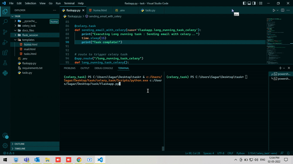
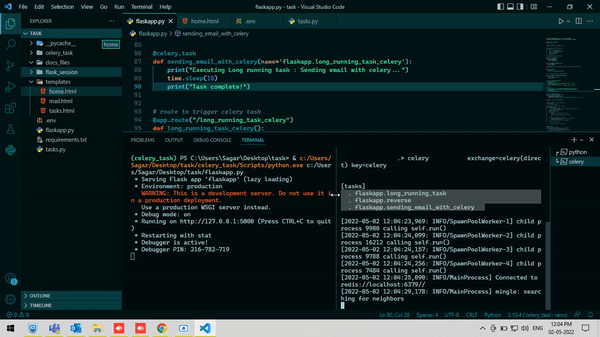

## Setup 

Learn how to Setup of celery in Flask Framework Application for this project you need to install some modules please install requirement.txt 

Clone the project/ Extract folder
```bash
git clone https://github.com/Sagar10-9402/celery-with-flask
```

Download Zip file and extract it.

Go to the project directory
```bash
cd directory of application
```

* Create `Virtual Envionment`
* Activate `Virtual Envionment`


Install dependencies
```bash
pip install -r requirements.txt
```

Start the server
```bash
python flaskapp.py
```

Check the project on Browser using
```bash
http://127.0.0.1:5000
```

Start Celery task quere in another terminal
```bash
celery -A flaskapp.celery worker --loglevel=INFO
```

for run this Application you need one broker and backend


| Brokers| Description |
| --- | --- |
| Redis | Redis can be both a backend and a broker. |
| RabbitMQ | RabbitMQ is a broker |
| Amazon SQS | SQS is a broker |
| SQLAlchemy | SQLAlchemy is backend |


`Please install all dependencies for run the Application `

To read about the celery just copy this link and pest it into your Browser
```bash
https://docs.celeryq.dev/en/stable/index.html
```

here is some links to read about broker and backend 
```bash
https://docs.celeryq.dev/en/stable/getting-started/backends-and-brokers/index.html
```

Here is some screenshots how celery cmd show output in terminal 
and shows the `task` which is define in our flask application 


# Hear are Example shown below





